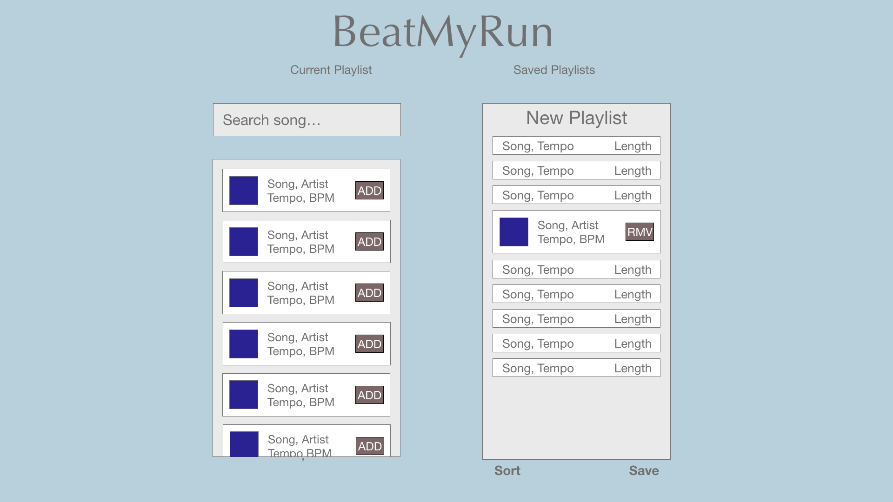
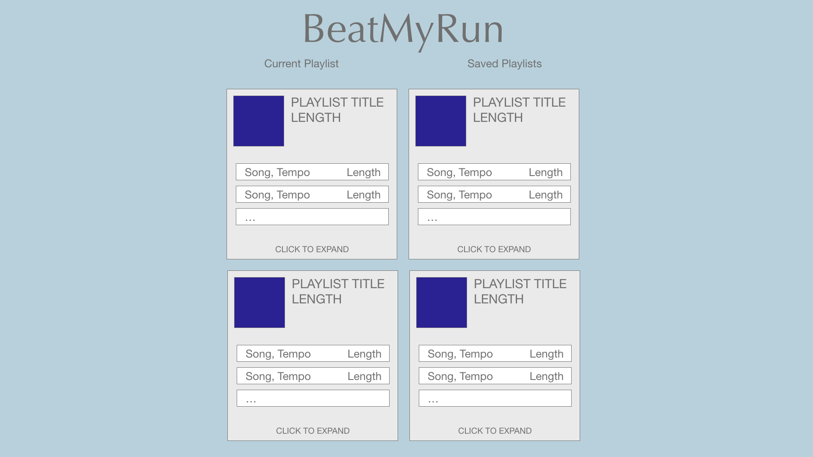
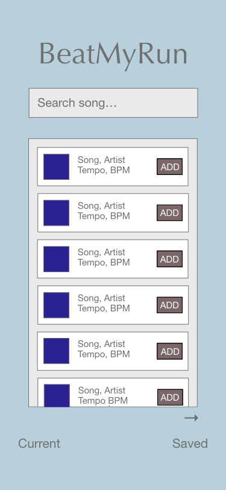
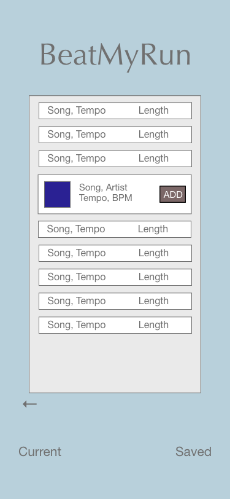
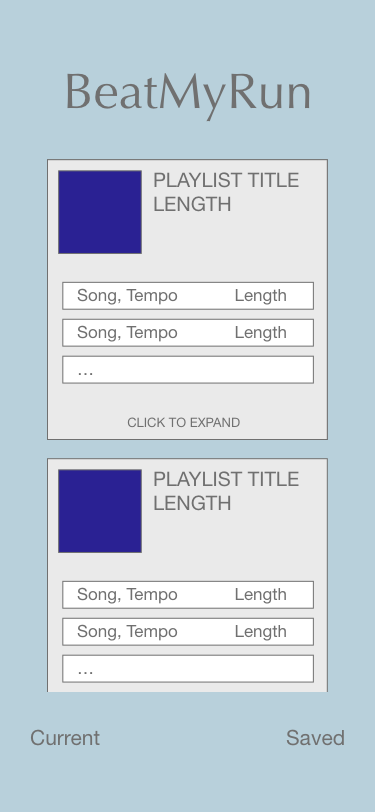

# Project Overview 

This is the NYC General Assembly Software Engineerning Immersive, Panda Cohort's "Project 2," created by Erinn Nelson.

## Project Description

The purpose of this app is to build a music playlist for running and exercise. Users may search for and receive information about songs through use of the [GetSongBPM](https://getsongbpm.com/api) API. Once displayed in search results, songs may be added to a playlist and sorted by tempo.

**Site Link:** [Beat My Run](http://beatmyrun.surge.sh/)

Created with [React](https://reactjs.org/).

### Set Up
* Fork and clone this repo
* cd into the app and `npm i`
* `npm start` to run a react server and launch the project

## Wireframes

**Desktop View:**




**Mobile View:**

  

### MVP/PostMVP

**MVP**
* App can successfully call API for song info based on a title input
* Results from search can be rendered on page as SongCards
* User may choose SongCards to add to a playlist
* User may remove SongsCards and clear playlist
* Song Cards can be sorted by tempo

**PostMVP**
* Visual indicators for Tempo in relation to running speed
* Playlists can be titled, saved and stored to local storage 
* Song Cards can be sorted manually
* SongCards in playlists can be expanded for more info
* Proved general info about running and healthy pacing

## React Component Hierarchy

* **\<App />**
    * \<header>
        * 'site title'
        * \<nav>
          * \<Link to='/'>
          * \<Link to='/playlists>
    * \<main>
      * **\<PlaylistBuilder />**
        * **\<SearchBox />**
          * **\<SearchInput />**
            * \<input type='text'>
          * **\<SearchResults />**
            * **\<SongCard />**
              * \
              * 'title, artist, tempo, length'
              * \<button onClick='add/remove/edit'>
        * **\<PlaylistEditor />**
          * **\<PlaylistCard/>**
            * 'playlist title, length'
            * \<button onClick='clear/remove'>
            * **\<SongCard />**
              * \
              * 'song title, artist, tempo, length'
              * \<button onClick='add/remove/edit'>
          * \<button onClick='sort'>
          * \<button onClick='save'>
      * **\<SavedPlaylists />**
        * **\<PlaylistCard />**
          * 'playlist title, length'
          * \<button onClick='clear/remove'>
          * **\<SongCard />**
            * \
            * 'song title, artist, tempo, length'
            * \<button onClick='add/remove/edit'>
    * \<footer>
      * \<a href='api credit'>
      * \<a href='github'>

## Functional Components
 
| Component | Description | 
| --- | --- |  
| PlaylistBuilder | User may search for songs and compile playlists with the results | 
| SearchInput | Searches the API database | 
| SearchResults | Displays results of a search | 
| PlaylistEditor | Takes and displays user selections from search | 
| PlaylistCard | Displays curated list of songs and includes editing options | 
| SongCard | Displays song image, title, artist, tempo and length | 
| SavedPlaylists | Displays previously saved playlists, saved to local storage | 

## Code Snippet

I wrote this code to interchangeably swap a \<p> tag and an \<input> field so that a user can retitle their playlist. It looks a lot uglier in the actual code due to poor choices and expirimention with state, but I'm pretty proud of how good the result looks.

```
handleRetitleClick = () => {
  this.setState({
    editTitle: true
  });
}

handleRetitleChange = (ev) => {
  let titleChange = ev.target.value;
  this.setState({
    title: titleChange,
  });
 }

handleRetitleSubmit = () => {
  if (!this.state.newPlaylist.title || this.state.newPlaylist.title.split(' ')[0] === '') {
    this.setState({
      title: 'New Playlist',
      editTitle: false
    });
  } else {
    this.setState({
      editTitle: false
    });
  }
}
```

## Issues and Resolutions

Currently the background image won't stay fixed on a mobile platform.

Proposed solution: wrap the entire body in a div and set it to scroll in a media query.

Had to deal with CORS and used a proxy.

Sorting posed some problems, not quite sure why.